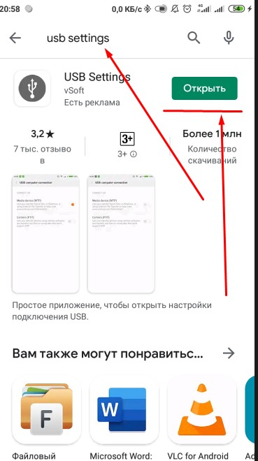

# help-mom
help Mom with her phone problem
# Как скопировать все файлы с телефона, с карты памяти на ноутбук.

План работы:
  - нужно чтоб была установлена программа USB SETTING на телеофне
  - подключен телефон к ноутбуку по проводу.
  
Итак:
---
> 1 программа USB Setting (для телеофна)
 > Если она установлена то значок ее в телефоне выглядит так:
> картинка 001.

---
> Если программы нет - то надо установить ее через Плей маркет:
> картинка 002

запускаем плей маркет - в поиске вводим название программы
и он находится 
> картинка 003

(у меня пишет открыть, так как она уже установлена)
(если не установлена то будет написано - установить)
>Когда программа установлена - подключили телефон к ноутбуку
запускаем программу
---
> картинка 004

> на темном фоне единственная кнопка по центру - USBSETTING
>  нажимаем ее
---
> картинка 005

> Справа от Медиоа-устройство (MTP)  есть преключатель - нажимаем его вправо
> на ноутбуке откроется окно проводника где будет доступ и к внутренней части памяти телефона и к карте.
---
> открываем внутреннюю память телефона
> выделяем все, нажимаем копировать
> и затем на компьютере создаем новую папку, открываем и нажимаем вставить
> картинки 006 и 007 

> после обработки начнется копирование.
если нужно тоже самое можно сделать и с картой памяти телефона.
----
